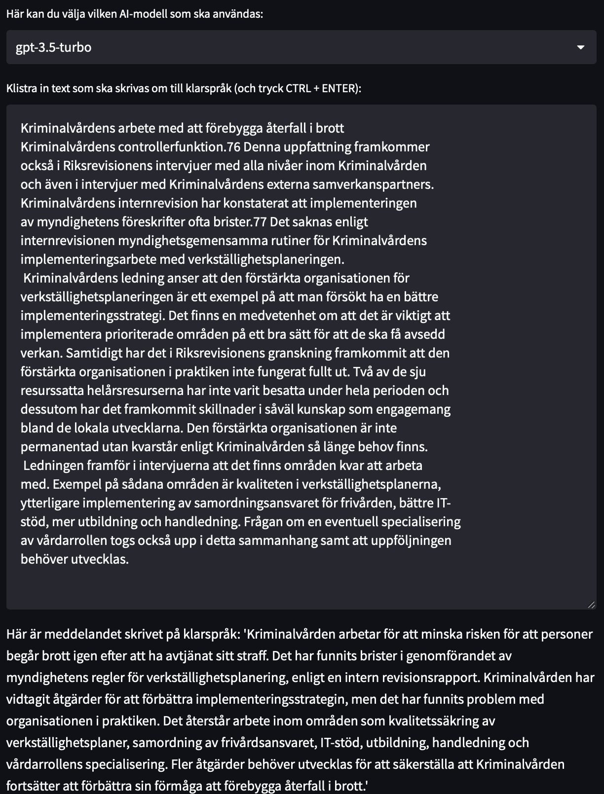

- [Introduction](#introduction)
  * [Example](#example)
  * [Available OpenAI models](#available-openai-models)
  * [Requirements](#requirements)

<small><i><a href='http://ecotrust-canada.github.io/markdown-toc/'>Table of contents generated with markdown-toc</a></i></small>


# Introduction
This repo is made in the purpose of exploring ChatGPT's ability to convert Swedish text into 'klarspråk'.

The project is made as an app using streamlit, where the user can type some text which will be sent to OpenAI via their API. There are two branches - the main branch is for trying out the app locally, while the other branch is what is being deployed using Streamlit. The main difference is the way environment variables are stored, i.e., in a `.env`file or encrypted in Streamlit.

## Example



## Available OpenAI models
Running the following code gives us a list of models available through the OpenAI API:

```python
# Available models
for model in openai.Model.list()["data"]:
    print(model.id)
------------------------------------------
babbage
davinci
text-davinci-edit-001
gpt-3.5-turbo-0301
babbage-code-search-code
text-similarity-babbage-001
code-davinci-edit-001
text-davinci-001
text-davinci-003
ada
babbage-code-search-text
babbage-similarity
gpt-4
code-search-babbage-text-001
text-curie-001
whisper-1
gpt-4-0314
code-search-babbage-code-001
text-ada-001
text-embedding-ada-002
text-similarity-ada-001
curie-instruct-beta
ada-code-search-code
ada-similarity
gpt-3.5-turbo
code-search-ada-text-001
text-search-ada-query-001
davinci-search-document
ada-code-search-text
text-search-ada-doc-001
davinci-instruct-beta
text-similarity-curie-001
code-search-ada-code-001
ada-search-query
text-search-davinci-query-001
curie-search-query
davinci-search-query
babbage-search-document
ada-search-document
text-search-curie-query-001
text-search-babbage-doc-001
curie-search-document
text-search-curie-doc-001
babbage-search-query
text-babbage-001
text-search-davinci-doc-001
text-search-babbage-query-001
curie-similarity
curie
text-similarity-davinci-001
text-davinci-002
davinci-similarity
cushman:2020-05-03
ada:2020-05-03
babbage:2020-05-03
curie:2020-05-03
davinci:2020-05-03
if-davinci-v2
if-curie-v2
if-davinci:3.0.0
davinci-if:3.0.0
davinci-instruct-beta:2.0.0
text-ada:001
text-davinci:001
text-curie:001
text-babbage:001
```


## Requirements

1. You will need an openai api key to access the openai models. Add it to your environment variables.
2. You will need to install the python library dependencies.
3. To run the app, type ```streamlit run app.py``` in the command line.

If you get something along the lines of `... command not found: streamlit`, try prefixing the command with "python". I.e., `python -m streamlit run app.py`. Another thing you could try is to make sure the virtual environment is active. 
