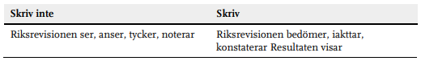

# Klarspråksriktlinjer för effektivitetsrevision (Riksrevisionen)

## Konkreta skrivsätt
Välj verb som kommunicerar att vi gör våra bedömningar neutralt utifrån 
revisionella iakttagelser och slutsatser. Undvik mer vaga, allmänna eller 
subjektiva uttryck som att Riksrevisionen ”anser”. 

Var tydlig med vem som har gjort något, för att vara revisionellt relevant. 
Undvik alltså formuleringar som är passiva, eller som saknar aktör, som 
”sker” eller ”har skett”.

### Ordbaserat

## Mer avancerade saker (för LLMs)

